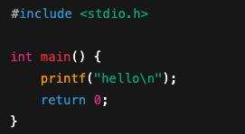
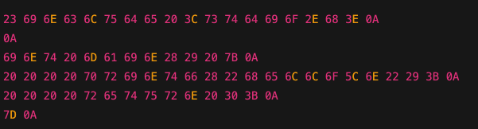
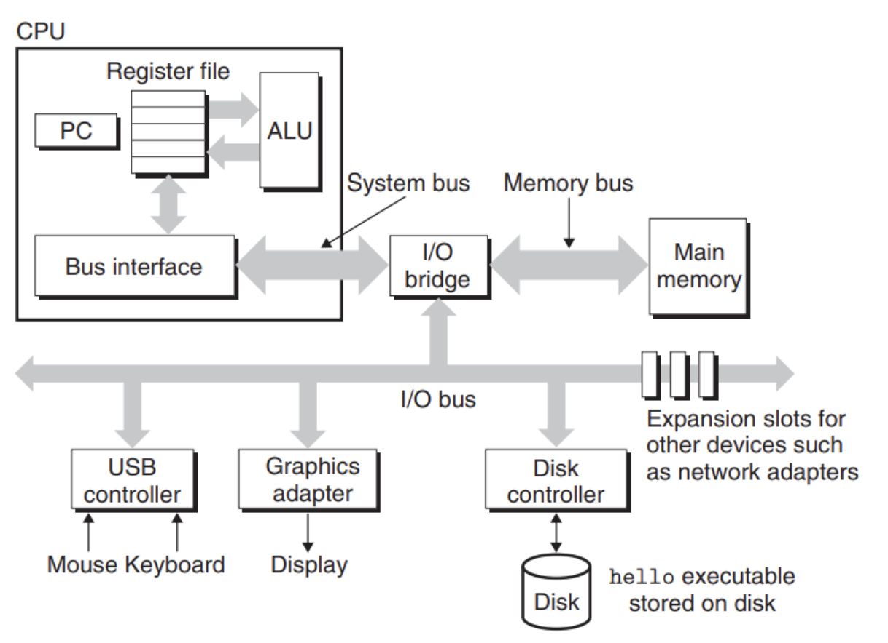
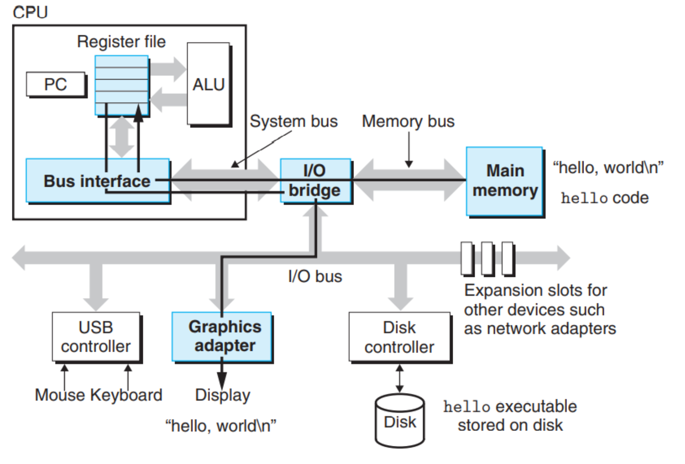
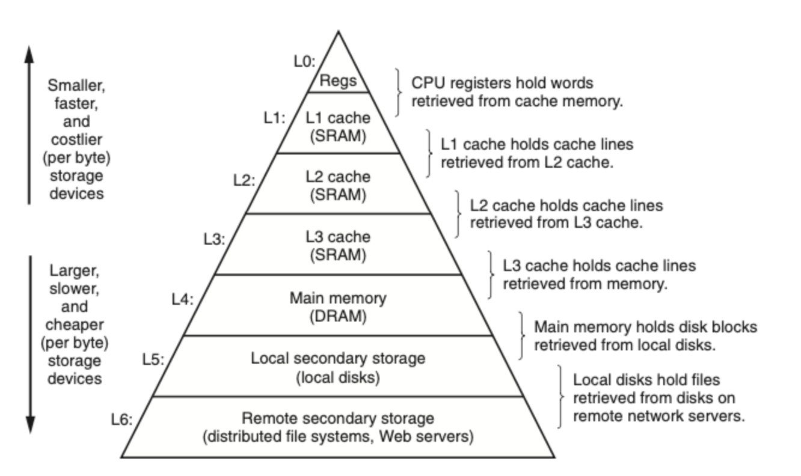
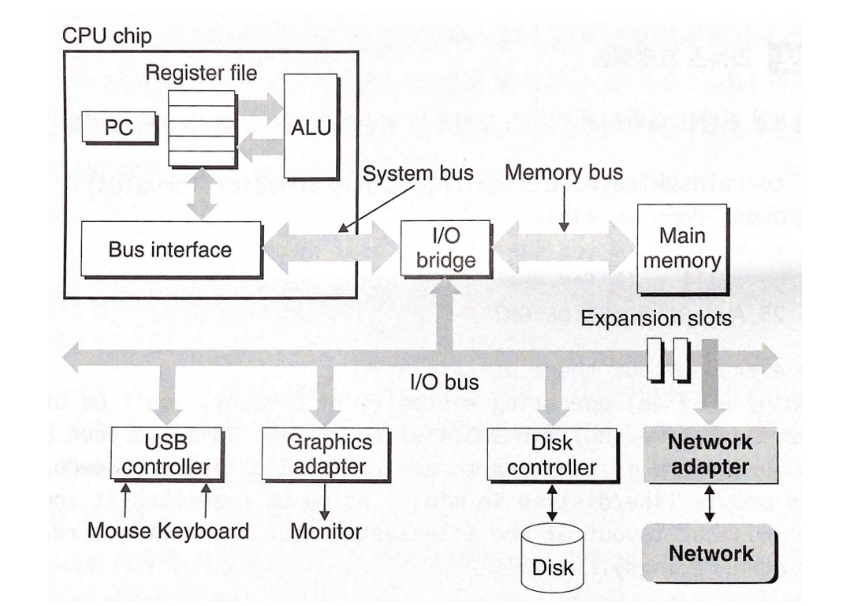
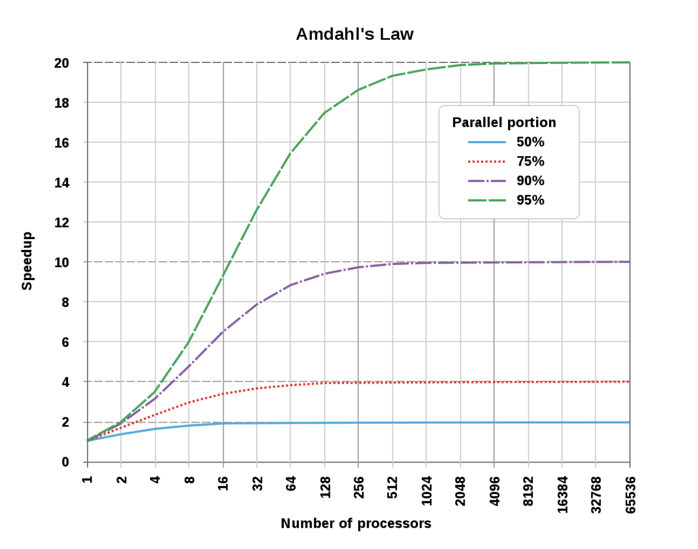
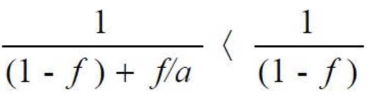

<h1>컴퓨터 시스템으로의 여행</h1>
<h2>1.1 정보는 비트와 컨텍스트로 이루어진다</h2>

위의 예시에서 보는 것처럼 컴퓨터시스템은 모든 텍스트 문자는 아스키 표준으로 나타내어 진다.

**아스키표준**
  : 각 문자를 바이트 길이의 정수 값으로 보여준다.
  단, 한글은 아스키에 포함이 되지 않기 때문에 유니코드를 압축해서 바이트 단위로 저장하는 방식을 사용한다.

  
<h2>1.2 프로그램은 다른 프로그램에 의해 다른 형태로 번역된다.</h2>
<h3>❔❓컴퓨터는 c언어 파일을 그대로 읽어서 실행하는가</h3>
정답은 아니다.   
컴파일러에 의해 컴퓨터가 이해할 수 있는 저급 기계어 인스트럭션들로 번역되어야 하고, 이때 생성된 목적 파일들이 실행 파일로 결합된다.
  

**컴파일 시스템**
 전처리 단계 -> 컴파일단계 -> 어셈블리단계 -> 링크단계로 이루어져 있다.

 1️⃣ 전처리 단계 : 소스 코드에서 "#"으로 시작하는 지시문들을 처리해 실제 컴파일 전에 코드 형태를 준비하는 단계 -> .i 파일 생성
  2️⃣ 컴파일 단계 : 텍스트 파일을 어셈블리어로 저장한다. ->.s 파일 생성
  3️⃣ 어셈블리 단계 : 어셈블리어를 기계어 인스트럭션으로 번역하고 목적파일을 생성해서 저장한다. ->.o 파일 생성
  4️⃣ 링크 단계 : 위의 파일들과 별도로 이미 컴파일된 목적파일( ex) printf )을 통합하는 작업을 수행해서 실행가능 목적파일인 실행파일을 생성한다.

  
<h2>1.3 컴파일 시스템이 어떻게 동작하는지 이해하는 것은 중요하다.</h2>

<h3>❔❓왜 알아야 하는가</h3>
1️⃣ 프로그램 성능 최적화하기 : 어떤 코드를 짜야 C 프로그램이 보다 효율적인지 알 수 있다.   
2️⃣ 링크 에러 이해하기 : 링커의 동작과 관련된 에러들을 처리할 수 있다 .  
3️⃣ 보안 약점 피하기 : 컴파일 시스템을 이해하고 있어야 보안 공격에 대비 할 수 있다.

  
<h2>1.4 프로세서는 메모리에 저장된 인스트럭션을 읽고 해석한다.</h2>

 
[버스 (Buses)]
 : 시스템 내를 관통하는 전기적 배선군으로 고정 크기의 바이트 단위인 워드로 바이트 정보를 전송한다.
 
[입출력장치]
 : 시스템과 외부세계와의 연결을 담당하며, 각 입출력장치는 컨토럴러나 어댑터를 통해 연결된다.
 
[메인메모리 (RAM)]
 : 프로세서가 프로그램을 실행하는 동안 데이터와 프로그램을 모두 저장하는 임시 저장장치이다.
 
[프로세서]
 : 프로세서 즉, 주처리장치(CPU)는 프로그램카운터(PC)가 가리키는 곳의 인스터럭션을 반복적으로 실행한다. 적재/저장/작업/점프 등이 있다.

 
예시) hello라는 프로그램의 실행 

1️⃣ 사용자가 에디터에 파일을 작성하고 저장한다 
-> 디스크에 hello.c 파일 저장 

2️⃣ 사용자가 컴파일 명령을 실행 
-> 디스크에 hello.o 파일 저장  

3️⃣ 실행하면 OS가 디스크에 저장된 파일을 읽음 
-> 메인메모리(RAM)에 파일 저장 

4️⃣ PC가 명령어 실행을 가르킴 -> CPU 작동 
-> 레지스터에 로드하고 필요하다면 ALU 연산 후 결과를 레지스터에 재로드 

5️⃣ 화면에 보여줄 내용이 있다면 표시 
-> 레지스터 또는 메모리에 보여주는 내용을 display로 전송 

  
<h2>1.5 캐시가 중요하다</h2>
위에서 볼 수 있듯이 시스템은 정보를 이동시키는 것에 꽤나 많은 시간을 투자한다. 또한 이러한 과정들이 프로그램의 실제 작업을 느리게 한다. 

 

✅ 그래서 보다 작고 빠른 캐시 메모리라고 부르는 저장장치를 고안했다.
  캐시 메모리 : 프로세서가 단기간에 필요로 할 가능성이 높은 정보를 임시로 저장할 목적으로 사용한다.
 ⭐️ 이러한 캐시 시스템의 이면에 깔려 있는 아이디어는 프로그램이 지엽적인 영역의 코드와 데이터를 액세스하는 경향인 지역성을 활용하는 것이다.

  
<h2>1.6 저장장치들은 계층구조를 이룬다.</h2>

  
✅ 아래로 갈수록 저장장치들은 더 느리고, 더 크고, 바이트당 가격이 싸진다. 

✅ 한 레벨의 저장장치가 다음 하위레벨의 저장장치의 캐시 역할을 한다.

  
<h2>1.7 운영체제는 하드웨어를 관리한다.</h2>

**운영체제는 두가지 주요 목적을 가지고 있다.** 
1️⃣ 제멋대로 동작하는 응용프로그램들이 하드웨어를 잘못 사용하는 것을 막는다 
2️⃣ 응용프로그램들이 단순하고 균일한 메커니즘을 사용하여 복잡하고 매우 다른 저수준 하드웨어 장치들을 조작할 수 있도록 한다.

운영체제는 정말 바쁜 관리자이다보니, **하드웨어를 잘게 나누어서 각 프로그램 또는 사용자에게 공평하고 편하게 나누어주어야 한다.** 그 방법에는 총 4가지가 있다.

1️⃣ 프로세스 – CPU 관리🧠  
실행 중인 프로그램에 실제 메모리, CPU, 자원등을 붙임으로써 운영체제가 일을 쉽게 할 수 있게 하는 단위 
 => 프로세스를 통해 운영체제는 각 프로그램마다 모두 CPU를 쓰는 것 처럼 착각하게 만들고 실제로는 아주 빠르게 왔다갔다 하는 방식으로 나누어 사용하게 함. 
 이를, **문맥전환** 이라고 하며 운영체제의 커널이 담당함.
 

2️⃣ 쓰레드(thread) - CPU + 병렬 실행을 세분화 관리 🧩
  하나의 프로세스 안에서 여러 작업을 동시에 처리하고 싶을 때 사용하는 것으로 프로세스 내부의 더 작은 실행 단위

3️⃣ 가상메모리 – 메모리(RAM) 관리🧵
 각 프로세스들이 메인 메모리 전체를 독점적으로 사용하고 있는 것 같은 환상을 제공한다.

4️⃣ 파일 – 저장장치(HDD, SSD 등)를 관리하는 방식 💽
 그저 연속된 바이트들로 디스크에 저장된 데이터를 운영체제가 관리하기 쉽게 하려고 만든 단위.
  001100 같은 형식이지만, 운영체제는 이걸 사진.jpg 등으로 사용자에게 전달함.

**즉, 운영체제는 하드웨어를 직접 다루지 못할 정도로 바쁘기 때문에 위와 같은 추상적인 개념들로 프로그램들이 자원을 쉽게 쓰게 한다.**

  
<h2>1.8 시스템은 네트워크를 사용하여 다른 시스템과 통신한다.</h2>

 
네트워크는 그림에서 볼 수 있듯이 또 다른 출력장치로 볼 수도 있다.

  
<h2>1.9 중요한 주제들</h2>
<h3>👩🏻‍🏫 Amdahl 법칙</h3>

: 프로그램에서 병렬 처리가 가능한 부분의 비율과 사용 가능한 코어 수를 기반으로, 전체 시스템의 **최대 성능 향상 한계** 를 계산하는 법칙이다.  
아무리 많은 코어를 사용하더라도, **직렬 처리되는 부분**이 존재하면 전체 성능 향상에는 **상한선**이 생긴다.  
이러한 병렬 처리의 한계는 "암달의 저주"라고도 불린다.

‼️ 코어 수가 증가해도 어느순간부터는 최대 성능이 증가하지 않는다.

개선된 속도에 대한 식으로  
1-f : 직렬 처리 f/a : 병렬 처리 가능을 뜻한다.

<h3>👩🏻‍🏫 동시성과 병렬성</h3>
동시성 : 다수의 동시에 벌어지는 일을 갖는 시스템에 관한 일반적인 개념
 병렬성 : 동시성을 사용해서 시스템을 보다 빠르게 동작하도록 하는 개념

 📌 쓰레드 수준 동시성 

멀티프로세서 : CPU가 여러개여서 동시 처리가 가능함
 멀티코어 프로세서 : CPU가 여러개의 코어를 갖고 있어 동시 처리가 가능함
 멀티쓰레딩(하이퍼쓰레딩) : 하나의 CPU가 여러 개의 스레드를 통해 동시 처리가 가능함

특히 요즘 CPU는 멀티코어 + 멀티쓰레딩 형태가 많음.
 
 📌 인스트럭션 수준 동시성 
 구형 마이크로프로세서들은 한 개의 인스트럭션을 실행하는데에 약 3.1개의 클럭사이클을 필요로 했다.
 기존 프로세서들은 이보다는 증가한 2.4개의 클럭사이클을 필요로 한다.

또한, 여러 가지 교묘한 기법에 의해 한번에 100개 까지의 인스트럭션도 실행할 수 있으며
  사이클 당 한 개 이상의 인스트럭션을 실행할 수 있는 프로세서를 슈퍼스케일러라고 한다.
  *클럭사이클 : CPU가 단일 명렬을 실행/처리 하는 단위 시간 단위

**싱글 인스트럭션, 다중 데이터 병렬성(SIMD)**
 이미지 처리, 과학/수학계산에서 쓰이는 것으로 하나의 명령어를 여러 데이터에 동시에 병렬로 적용하는 구조를 의미
 

 
