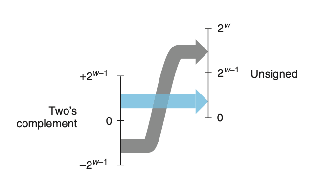

# 🖥️ 정수의 표시 (Integer Representation) 

정수를 표현하는 방법은 크게 두 가지가 있다:

> **unsigned (비부호형)**: 양수만 표현 가능<br>
> **signed (부호형)**: 음수, 0, 양수 모두 표현 가능

두 자료형은 수학적 특성이나 컴퓨터 수준의 구현에서 매우 밀접한 관계가 있으며, **같은 비트 벡터를 해석하는 방법의 차이**일 뿐이다. 따라서 컴퓨터는 이 두 자료형을 동일한 방식으로 처리하되, **해석 방식만 다르게** 적용한다.

---

## C언어의 정수형 타입 🧠

C 언어는 정수의 유한한 범위를 표현하기 위해 다양한 정수형 데이터 타입을 제공한다. 이때 정수형의 크기(워드 길이)는 시스템 또는 컴파일 환경에 따라 달라진다. 일반적으로 `int`, `long`, `short` 등으로 표현된다.

특히 **signed 정수형**은 범위가 대칭적이지 않다는 점에 주의해야 한다:

> 예: signed 4비트 정수는 -8 \~ +7 범위를 갖는다. 0이 양수 범위에 포함되므로 대칭적으로 보이지 않는다.

---

## 비부호형 인코딩 (B2U: Binary to Unsigned) 🔢

비트 벡터를 \*\*비부호형(unsigned)\*\*으로 해석하는 방식:

* 각 워드(비트 시퀀스)는 0부터 $2^w - 1$ 사이의 **유일한 정수**로 매핑됨
* 역변환도 가능 (즉, 어떤 비트 벡터든 그에 해당하는 정수 존재)

예:

```
0011 0000 0011 1001 (16비트) => 12345 (unsigned)
```

---

## 2의 보수 인코딩 (B2T: Binary to Two's Complement) 🧾

비트 벡터를 **2의 보수(signed)** 방식으로 해석하는 방법:

* \*\*MSB(Most Significant Bit)\*\*를 음수 자리값으로 해석
* 모든 음수를 표현하고 연산이 자연스럽게 작동하도록 설계
* 표현 가능한 정수 범위: $T_{min} = -2^{w-1}$ \~ $T_{max} = 2^{w-1} - 1$

예:

```
2의 보수 16비트 값: 1100 1111 1100 0111 => -12345
```

---

## 부호형 ↔ 비부호형 변환 🔁

C 언어는 서로 다른 정수형 간 \*\*캐스팅(casting)\*\*을 허용한다. 단, 다음과 같은 주의가 필요:

* **음수 → 비부호형**: 매우 큰 양수로 변환됨
* **큰 unsigned → signed**: 값이 TMax를 초과하면 잘못된 값으로 해석될 수 있음

> ⚠️ 캐스팅은 비트 값은 그대로 유지하되, **해석 방식만 바뀐다.**

예시:

```c
int x = -12345;
unsigned int ux = (unsigned int)x; // ux = 53191
```

이때 `-12345`의 2의 보수 표현은:

```
1100 1111 1100 0111 (=> 53191 in unsigned)
```



즉, 음수는 비부호형으로 변환 시 $2^w$ 만큼 증가한 수로 해석된다.


## 요약 🧾

| 구분          | 비부호형 (unsigned)  | 2의 보수형 (signed)            |
| ----------- | ---------------- | -------------------------- |
| 표현 범위 (w비트) | 0 \~ $2^w - 1$   | $-2^{w-1}$ \~ $2^{w-1} -1$ |
| MSB 해석      | 일반 자리값           | 음수 자리값 ($-2^{w-1}$)        |
| 캐스팅         | 비트 유지, 해석 방식만 변경 | 동일                         |


## 📌 팁

* ✅ **2의 보수 이해 핵심**: 가장 왼쪽 비트(MSB)를 음수 값으로 해석하면 쉽게 계산 가능
* ✅ **음수 표현 시 2의 보수 연산**: `~x + 1` 을 기억하세요 (1의 보수 뒤 +1)
* ✅ **캐스팅 시 주의점**: 부호 해석이 바뀌므로 예상치 못한 결과 발생 가능 – 디버깅할 때 주의!
* ✅ **디버깅 팁**: 비트를 직접 이진수로 출력해 보면 해석이 훨씬 쉬워집니다 (`printf("%x", val)` 등 활용)

---


