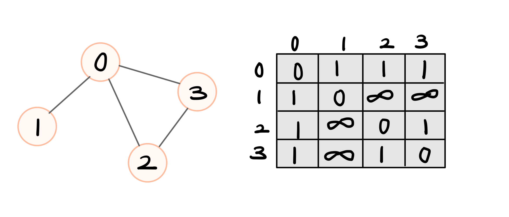
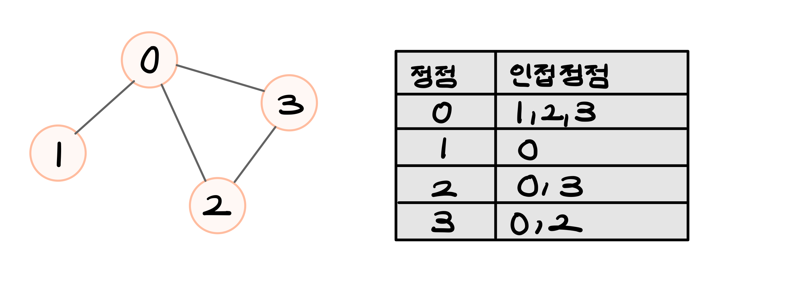
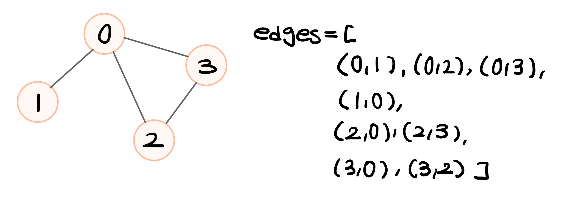

# 📂 그래프 자료구조

## 📌 그래프란?
- **노드(Vertex, 정점)** 와 **간선(Edge)** 으로 이루어진 **비선형 자료구조**
- 트리(Tree)도 그래프의 일종 (사이클 없는 방향 그래프)
- 리스트, 스택, 큐 등 **선형 자료구조**와는 다름

💡 서로 간에 "관계"가 있는 데이터 => **그래프**로 모델링!

## 📂 그래프의 종류

| 구분         | 그래프 종류            | 설명                                                                 | 예시 |
|--------------|------------------------|----------------------------------------------------------------------|------|
| 🔁 방향성     | 방향 그래프 (Directed Graph) | 간선에 **방향이 있음**. A → B 와 B → A 는 다름.                       | 트위터 팔로우, 웹 링크 |
|              | 무방향 그래프 (Undirected Graph) | 간선에 **방향이 없음**. A ― B 와 B ― A 동일.                          | 페이스북 친구 관계 |
| ⚖️ 가중치     | 가중치 그래프 (Weighted Graph) | 간선에 **비용 또는 가중치**가 있음.                                  | 도로 길이, 운임 |
|              | 비가중치 그래프 (Unweighted Graph) | 간선에 **가중치가 없음**, 연결 여부만 중요.                            | 단순 연결 구조 |
| 🔄 순환 여부  | 순환 그래프 (Cyclic Graph) | **싸이클(순환)**이 존재하는 그래프.                                  | 작업 의존성 오류 |
|              | 비순환 그래프 (Acyclic Graph) | **싸이클이 없음**. → 방향 그래프 중 싸이클이 없으면 **DAG**라고 함.   | 위상정렬 그래프 |
| 🔗 연결성     | 연결 그래프 (Connected Graph) | **모든 노드가 연결**되어 있음.                                        | 전체 친구가 연결된 SNS |
|              | 비연결 그래프 (Disconnected Graph) | **하나 이상의 노드가 고립**되어 있음.                                 | 단절된 네트워크 |
| 🪜 트리 여부  | 트리 (Tree)              | 싸이클 없고, 모든 노드가 하나의 경로로 연결됨. **N-1개의 간선**        | 폴더 구조 |
|              | 포레스트 (Forest)        | 여러 개의 트리로 이루어진 **비연결 비순환 그래프**                     | 여러 독립적 조직 |


### 🌍 그래프 활용 예시
- 컴퓨터 네트워크
- 교통 시스템
- 소셜미디어
- 지도, 추천 시스템 등  
→ **현실 세계의 복잡한 구조를 모델링** 가능!


## 📊 그래프의 표현 방식

### 1. 인접 행렬 (Adjacency Matrix)
- 각 노드가 연결된 상태를 2차원 배열로 저장
- **자기 자신은 0**, 연결되어 있으면 **1**, 아니면 **0** or **∞** 로 설정

#### ✅ 장점
- **두 노드가 연결되어 있는지 바로 확인 가능**  
  → `O(1)`의 시간복잡도를 가짐

#### ❌ 단점
- 모든 관계를 기록해야 하므로, **노드 수가 많을수록 메모리 낭비**
- 간선이 적은 그래프(희소 그래프)에서는 **비효율적**
- **불필요한 0 값**, 즉 두 정점간의 인접성이 존재하는 경우보다 존재하지 않는 경우가 더 많기 때문에 공간낭비가 심하다

<br>



### 2. 인접 리스트 (Adjacency List)
- 각 노드에 **연결된 노드 목록만 따로 저장**
- **연결리스트** or **배열**을 활용
- Python: `append()` 메서드로 미리 크기 지정할 필요 없이 쉽게 구현 가능  
  * C/C++/Java 는 크기 지정 후 구현

#### ✅ 장점
- **메모리 효율적** (간선이 적은 경우)
- 연결된 노드만 기록 → **순회시 빠름**

#### ❌ 단점
- 두 노드가 연결되었는지 확인하려면 **리스트를 하나씩 확인해야 함**  
  → `O(k)` 시간 (k는 연결된 노드 수)
- 즉, 연결되어 있는 노드가 많은 경우 시간이 걸릴 수 있음

<br>



### 3. 간선 리스트 (Edge List)

- 모든 **간선을 (시작 노드, 도착 노드)** 혹은 **(시작, 도착, 가중치)** 형태로 따로 저장
- 연결 관계를 2차원 배열이 아닌, **단일 리스트**에 담음

#### ✅ 장점
- 리스트를 하나만 사용하기 때문에 가장 간단한 구조
- 간선 수 만큼 저장하기 때문에 메모리 사용량이 가장 적음


#### ❌ 단점
- 두 노드가 연결되었는지 확인하려면 **모든간선** 을 전부 다 탐색해야 함
- 인접하는 노드를 바로 찾기가 어려워서 DFS/BFS 문재와는 맞지 않음


<br>


## 📎 추가 개념 : 인접 해시테이블 (Adjacency Hash Table)

- **딕셔너리 기반의 인접 리스트 구조**
- 노드 번호가 **정수가 아니거나 매우 큰 경우**에도 유용
- 노드를 **키(key)** 로 사용하고, 연결된 노드들을 리스트로 저장함


### ✅ 구조 예시 (Python)

```python
# 노드가 정수가 아닌 문자열인 경우에도 사용 가능
graph = {
    'A': ['B', 'C'],
    'B': ['A'],
    'C': ['A', 'D'],
    'D': ['C']
}
```
또는 노드 번호가 10억처럼 클 때도 효율적:

```python
graph = {
    1000000000: [999999999],
    999999999: [1000000000]
}
```

                        
## ✅ 장점
- 노드가 **문자열, 해시 가능한 객체**여도 사용 가능
- 노드 번호가 **희소하거나 비연속적**이어도 공간 낭비 없음
- Python의 `dict` 자료형을 활용해 구현이 매우 직관적


## ❌ 단점
- 배열에 비해 접근 속도는 느릴 수 있음  
  (`O(1)` 평균이지만 해시 충돌 시 최악 `O(n)`)
- C/C++처럼 **정적 타입 언어에선 구현 난이도↑**


