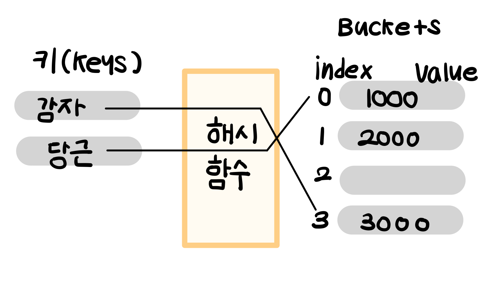
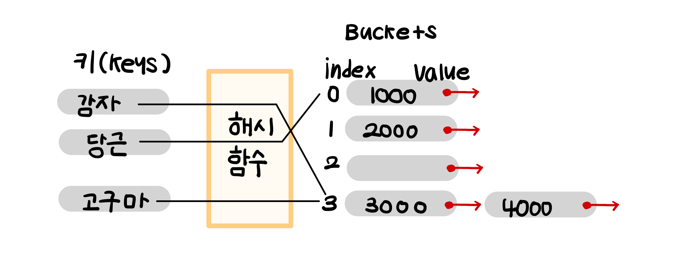
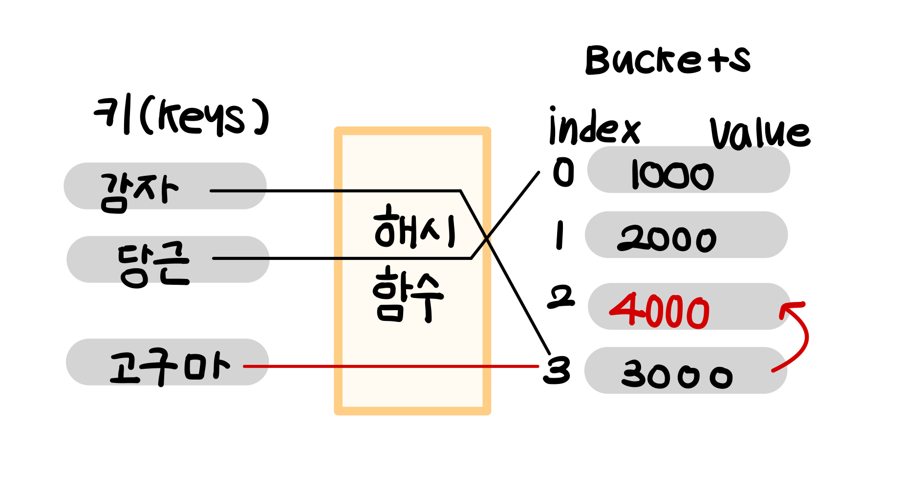

# 📥 해시테이블 

## 해시테이블이란?

>**(key,value)** 형식으로 데이터를 저장하는 구조


내부적으로 배열(버킷)을 사용하여 데이터를저장하는 자료구조로 각각의 Key 값에 대해 해시함수를 적용해서 배열의 고유한 index에 값을 저장하거나 검색한다.
> 📕 **해시 관련 키워드** <br>
> 해시 : 임의 값을 고정 길이로 변환하는 것 <br>
> 해싱함수 : Key에 대해 산술 연산을 이용해 데이터 위치를 찾을 수 있는 함수 <br>
> 해시값 또는 해시주소 : key를 인자로 받아 해싱함수로 연산한 값, 인덱스로 활용<br>
> 슬롯(버킷) :한 개의 데이터를 저장할 수 있는 실제 저장 장소



## 해시테이블에 값을 저장하는 과정
1️⃣ index = hash_function(keys) : 인덱스 값을 매핑한다.

2️⃣ array[index] = "value"  : 해시테이블에 값을 저장한다.

## ❓⁇ 🤔 인덱스 값이 겹치면 어떡하지? 

해싱함수의 결과로 인하여 인덱스가 겹치는 상황을 처리하기 위하여 다양한 방법이 존재한다.


## 1. 🔗 분리 연결법 (Separate Chaining)
: 동일한 버킷에 저장되어야 하는 데이터에 체인을 걸어 찾는 데이터가 나올때까지 계속 체일을 따라가는 방식



### 🖇️ 연결리스트 기반 분리 연결법 (LinkedList-Based Chaining)
* 각 버킷(bucket)에 데이터를 **연결 리스트**로 저장함
* 충돌이 생기면 해당 버킷의 리스트에 노드를 추가함

### ✅ 장점

* 구현이 간단하고 삭제가 용이하다
* 공간을 필요할때마다 할당할 수 있고 데이터 수에 제한이 없기 때문에 가변적인 데이터에 유용하다 (삽입 실패 없음)
* 제한된 bucket을 효율적으로 사용할 수 있다

### ❌ 단점

* 해시테이블 자체는 O(1) 이지만, 특정 슬롯에 연결된 자료가 많은 경우에는 연결 리스트는 탐색이 느림 → O(n)
* 저장 데이터가 작을 경우 포인터 비용이 커져서 **메모리 오버헤드** 발생
*  비연속 → **캐시 효율성 낮음**
 > 연결 리스트는 메모리가 흩어져 있음
리스트(list)나 배열(array)은 연속된 메모리에 저장돼.
<br>👉 그래서 CPU가 데이터를 미리 읽어두는(prefetch) 기능을 잘 활용함 (캐시 히트율 ↑)<br>
반면, **연결 리스트는 노드가 메모리 여기저기 흩어져 있음**
👉 다음 노드로 가려면 포인터 따라 점프 🪂

---

### 🌳 트리 기반 분리 연결법 (Tree-Based Chaining)

* 충돌이 많아져서 하나의 버킷에 노드가 너무 많아질 경우
* 연결 리스트 대신 **이진 탐색 트리(BST)** 혹은 **레드-블랙 트리**를 사용

```text
예: bucket[3]
           ["감자"]
           /     \
      ["고구마"]   ["당근"]
```

### ✅ 장점

* 탐색, 삽입, 삭제가 **O(log n)** 으로 개선됨
* Java 8의 `HashMap`은 실제로 이 기법을 적용함 (노드 수 8개 이상이면 트리로 전환)

### ❌ 여전히 남는 단점

* 트리도 포인터를 2개(left, right) 갖기 때문에 **메모리 오버헤드 증가**
* 메모리 구조가 비연속이라 **캐시 효율성 낮음** (연결 리스트와 동일)


## 📚 트리 방식이 해결하는 것과 못하는 것

| 항목        | 트리 방식의 효과             |
| --------- | --------------------- |
| 🔍 탐색 시간  | ✅ O(n) → O(log n) 개선  |
| 💾 메모리 낭비 | ❌ 여전히 포인터가 많아 오버헤드 있음 |
| 🧠 캐시 효율성 | ❌ 메모리 비연속 → 캐시 미스 발생  |


## 🎲 2. Open Addressing (개방 주소법)

- **충돌이 발생하면 테이블 내의 다른 버킷을 탐색**하여 빈 공간에 저장한다.
- 테이블 내의 빈 공간 활용 → 추가 메모리 구조 없음



### 주요 방식
#### 📍 1) Linear Probing (선형 탐사)
- 다음 인덱스를 고정 폭 만큼 증가하며 탐색
- `index = (hash(key) + i) % table_size`
- 🍀 단순해서 계산하기 쉽고 연속적이기 때문에 캐시 효율이 좋다
- 🚨 특정 해시 값 버킷 근처에 값들이 뭉쳐서 평균 탐색 시간이 늘어난다. (primary clustering)

#### 📍 2) Quadratic Probing (제곱 탐사)
- 탐색 간격을 제곱으로 증가시킴
- `index = (hash(key) + i^2) % table_size`
- 🍀 선형탐색에 비해 간격이 넓어서 탐색과 삭제에 효율적
- 🚨 Secondary Clustering

#### 📍 3) Double Hashing (이중 해싱)
- 2개의 해시 함수를 이용해 탐색 간격 결정
- `index = (hash1(key) + i * hash2(key)) % table_size`
- 🍀 클러스터링의 영향을 거의 받지 않음
- 🚨 한번 더 해싱하기 때문에 연산량이 증가

### ✅ 장점
- 추가적인 메모리 구조 없이 배열 내에서 처리
- 캐시 효율성 좋음 (연속된 메모리 탐색)

### ❌ 단점
- 삭제 처리가 복잡 (삭제 마커 필요)
- 클러스터링 현상 발생 가능 (특히 Linear Probing)
- 테이블이 거의 다 차면 성능 급하락

| 항목      | Primary Clustering                | Secondary Clustering            |
| ------- | --------------------------------- | ------------------------------- |
| 발생 조건   | **인접한 버킷**끼리 점점 덩어리가 커질 때         | 해시값은 같지만 **점프 경로도 같아서** 또 충돌할 때 |
| 발생 위치   | 연속된 공간에 데이터가 몰릴 때                 | 점프 경로가 겹쳐서                      |
| 대표 방식   | Linear Probing                    | Quadratic Probing               |
| 클러스터 크기 | 큼 (점점 뭉침)                         | 작음 (분산돼 보이지만 겹침)                |
| 해결책     | Quadratic Probing, Double Hashing | Double Hashing만 효과적             |

<br>


## 📚 정리 요약

| 방식 | 설명 | 장점 | 단점 |
|------|------|------|------|
| Separate Chaining | 연결 리스트로 충돌 처리 | 구조 단순, 확장성 높음 | 메모리 낭비, 캐시 비효율 |
| Linear Probing | 선형으로 다음 위치 탐색 | 구현 쉬움, 캐시 효율 높음 | 클러스터링 발생 |
| Quadratic Probing | 제곱 간격으로 탐색 | 클러스터링 완화 | 탐색 실패 가능성 ↑ |
| Double Hashing | 2개의 해시 함수로 간격 조절 | 충돌 분산 ↑ | 구현 복잡도 높음 |

