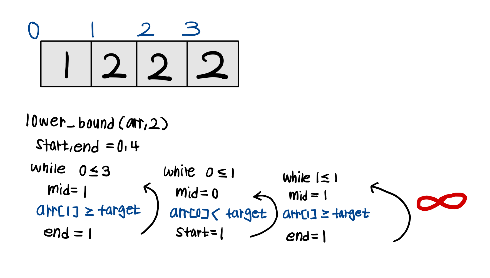
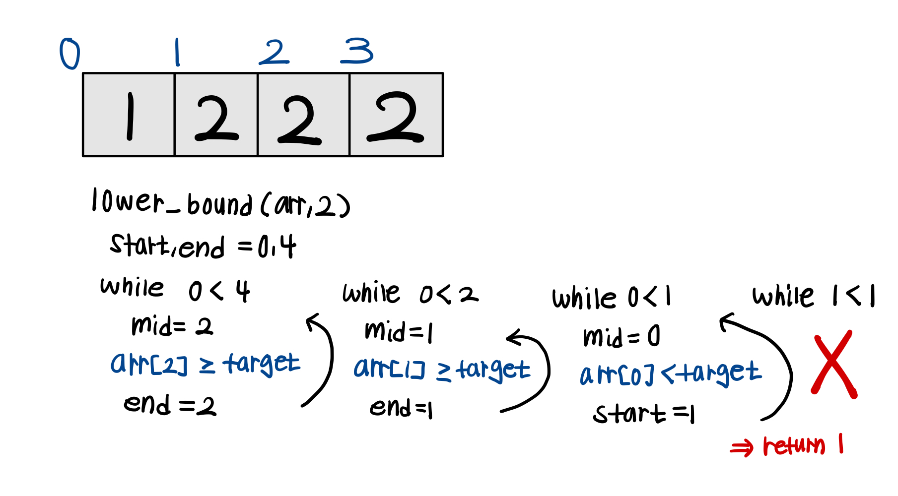

# ‼️ 경계 vs 값 


```python
# target의 첫 등장 위치 (lower bound)
def lower_bound(arr, target):
    start, end = 0, len(arr)
    while start < end:
        mid = (start + end) // 2
        if arr[mid] >= target:
            end = mid
        else:
            start = mid + 1
    return start


# target의 마지막 등장 위치 (lower bound)
def upper_bound(arr, target):
    start, end = 0, len(arr)-1
    while start < end:
        mid = (start + end) // 2
        if arr[mid] > target:
            end = mid
        else:
            start = mid + 1
    return start
```

### 📌 while start < end :
while start <= end 의 조건은 무한 반복이 발생함



### 📌 ✨ start, end = 0, len(arr) :
기존에 특정 값을 찾는 이분탐색과 달리 end 지점은 len(arr)이 되어야 함



why ?❓

기존 이분탐색 처럼 end 조건을 **len(arr) -1** 로 구현하면 마지막이 끝나는 **"경계"** 를 구할 수 없음 


## 🔑 경계 vs 값 핵심 정리

| 설정                   | 범위          | 탐색 가능한 위치            | 언제 사용?             |
| -------------------- | ----------- | -------------------- | ------------------ |
| `end = len(arr)`     | \[0, len]   | 값이 없을 경우 맨 끝까지 탐색 가능 | lower/upper\_bound |
| `end = len(arr) - 1` | \[0, len-1] | 배열 내부만 탐색            | 값이 있는지 찾을 때만 사용 가능 |

